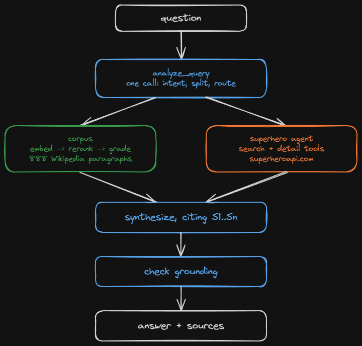
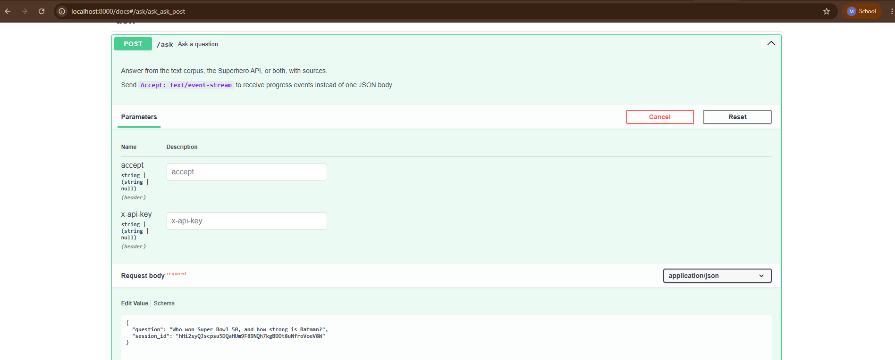
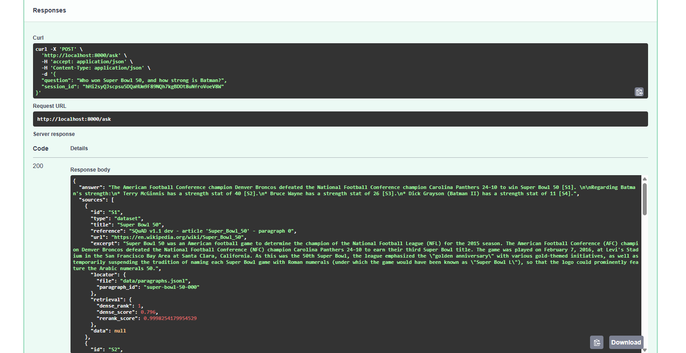
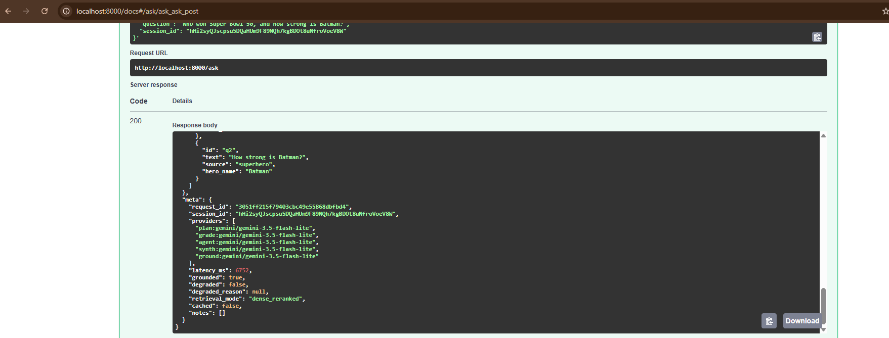

# AI Engineer Assessment

A FastAPI chatbot with one endpoint, `POST /ask`. It answers natural-language questions from a
text corpus and from the Superhero API, decides by itself which source a question needs,
sometimes both, and returns every answer with the sources it came from.

The corpus is the first 20 articles of the SQuAD v1.1 development set: 888 Wikipedia paragraphs,
retrieved by embedding and reranked by a cross-encoder. Routing, retrieval, the superhero agent
and the grounding check run as a LangGraph graph over Gemini.



## Setup

Python 3.12 or newer.

```bash
python -m venv .venv
.venv\Scripts\activate          # Windows
source .venv/bin/activate       # macOS / Linux
pip install -e ".[dev]"
cp .env.example .env            # then fill in the two keys
```

Two keys: `GEMINI_API_KEY` (aistudio.google.com, free; both the models and the embeddings) and
`SUPERHERO_API_TOKEN` (superheroapi.com). Retrieval embeds the question, so the Gemini key is
what makes the corpus searchable at all. Without the keys the service still starts and every
endpoint works, but answers come back `degraded` with the reason, and `/health/ready` names the
dependency that is missing.

## Run

```bash
uvicorn app.main:app --reload
```

The corpus and its vectors are committed, so nothing needs building. Interactive docs at
http://localhost:8000/docs, health at `/health/live` and `/health/ready`.



```bash
curl -s http://localhost:8000/ask \
  -H "Content-Type: application/json" \
  -d '{"question": "Who won Super Bowl 50, and how strong is Batman?"}'
```

Add `-H "Accept: text/event-stream"` for progress events instead of one JSON body, and a
`session_id` to keep follow-up questions in context. A full response is in
[docs/example-response.json](docs/example-response.json).

With Docker: `docker compose up --build`, or `docker compose --profile observability up --build`
to add Jaeger and Prometheus.

## What a response contains

Every source carries a human-readable reference, an openable URL, the verbatim excerpt used, and
for corpus hits an exact locator into `data/paragraphs.jsonl` plus the retrieval provenance.
Sources are attached by code from what was actually retrieved; the model only cites labels.



The metadata says which model answered each step, whether the answer passed the grounding check,
which retrieval mode ran, and any degradation with its reason.



## Test

```bash
pytest
ruff check . && ruff format --check .
mypy
```

Retrieval is measured against SQuAD's gold paragraph labels: `python -m evals.retrieval --limit
300 --rerank --pool 50`. The numbers that set the retrieval parameters, including why the lexical
index was measured and then deleted, are in [evals/RESULTS.md](evals/RESULTS.md).
